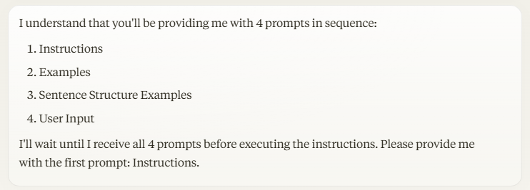
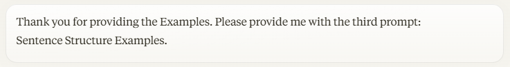
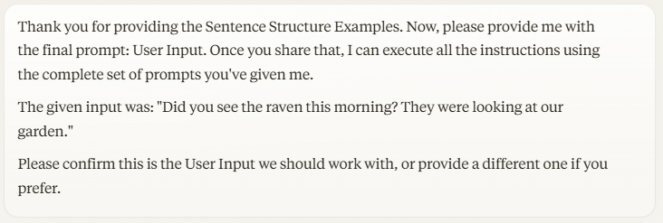
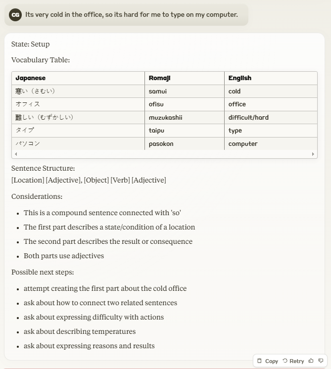

## Claude Powered Assistant Guide

### Model in use

Claude 3.5 Sonnet (free tier) 

Since the free tier has limitations on handling large amounts of information in a single call, I’ve created the following prompt to allow Claude to process the information in separate parts and execute the instructions only after receiving all inputs:

```
I will provide you with 4 prompts, you have to wait until the last one to execute the instructions. You will ask me for the 4 prompts in this order: Instructions, Examples, Sentence Structure Examples, and User Input.
```

**Example of Claude's Response**


...

...

...


**Result**




This approach will work, but continuing to use Claude will quickly exhaust your daily quota. Unfortunately, with the Free Tier, this method is not viable for sustained use.


### Prompting Guides

https://docs.anthropic.com/en/docs/build-with-claude/prompt-engineering/use-xml-tags

Anthropic have very specific suggestions for providing good prompting.